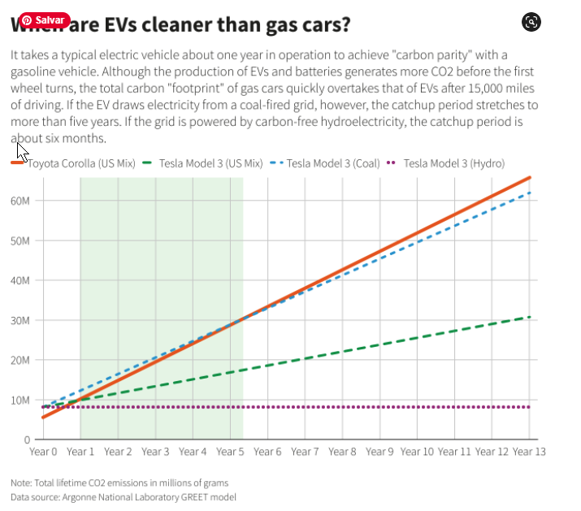

```{r child = "setup.Rmd"}
```

```{r xaringan-tile-view, echo=FALSE}
xaringanExtra::use_tile_view()
```

```{r xaringan-editable, echo=FALSE}
xaringanExtra::use_editable(expires = 1)
```

```{r xaringan-panelset, echo=FALSE, message=FALSE, warning=FALSE}
xaringanExtra::use_panelset()
xaringanExtra::style_panelset_tabs(panel_tab_font_family = "sans-serif")
```

```{r xaringanExtra-clipboard, echo=FALSE}
htmltools::tagList(
  xaringanExtra::use_clipboard(
    button_text = "<i class=\"fa fa-clipboard\"></i>",
    success_text = "<i class=\"fa fa-check\" style=\"color: #90BE6D\"></i>",
    error_text = "<i class=\"fa fa-times-circle\" style=\"color: #F94144\"></i>"
  ),
  rmarkdown::html_dependency_font_awesome()
)
```

```{r xaringan-fit-screen, echo=FALSE}
xaringanExtra::use_fit_screen()
```

```{r xaringan-extra-styles, echo=FALSE}
xaringanExtra::use_extra_styles(
  hover_code_line = TRUE,         #<<
  mute_unhighlighted_code = TRUE  #<<
)
```


```{r xaringan-scribble, echo=FALSE}
xaringanExtra::use_scribble()
```


class: middle

## - Impressão 3D
## - Digital twins

---
class: center, middle

## Retrospecto

---

## Definições

### Logística

.midi[
.question[
“**Logística** é dispor a **mercadoria ou o serviço** certo, no **lugar** certo, no **tempo** certo e nas **condições desejadas**, ao mesmo tempo em que fornece a **maior contribuição à empresa**”. 
(Ballou, 2001)
]
]

### Gestão Cadeia de Suprimentos

.question[
.midi[
**Cadeia de suprimentos** é a estrutura consolidada e integrada, em níveis estratégico, tático e operacional, entre agentes de produção, mercadológicos, logísticos e sociedade, para que seja possível coordenar as operações de maneira a garantir a gestão orientada à logística, tendo como objetivo o _trade-off_ entre **responsividade** e **eficiência**, além de garantia de um contexto sustentável de desenvolvimento por ações **socialmente responsáveis** e **resilientes.** 
]
]

---

# Cidades

## Definição 

+ A urbanização ocorre tanto pela mudança da população rural para núcleos urbanos como com o crescimento vegetativo da população urbana. 
+ Este processo teve início na primeira metade do século XIX.
+ Em 1800, apenas quatro por cento da população mundial vivia em cidades. 
+ Em 2000, esse número havia crescido para 50%. Hoje, há mais pessoas morando em cidades maiores (KAPLAN et al., 2004).
+ 54 % da população mundial vive em áreas urbanas (UN, 2014)
+ 2050 – 66% de população urbana

---

# Urbanização

```{r echo=FALSE, message=FALSE, warning=FALSE}
knitr::include_graphics("img/urb.jpg")
```


---

## Estrutura urbana global

+ As cidades pequenas são numerosas e muitas crescem rapidamente.
+ Globalmente, cerca de metade dos 3,9 bilhões de habitantes reside em pequenas cidades com até 500 mil habitantes, enquanto que apenas um em oito vive nas 28 megacidades com 10 milhões de habitantes ou mais. 
+ África e a Ásia são o lar de aproximadamente 90 por cento da população rural mundial. 
+ A Índia tem o maior número de população rural com 857 milhões, seguida da China com 635 milhões.

---
## Logística Urbana

```{r echo=FALSE, message=FALSE, warning=FALSE, out.width="90%"}
knitr::include_graphics("img/veiculo.png")
```
---

## Logística Urbana

```{r echo=FALSE, message=FALSE, warning=FALSE, out.width="75%"}
knitr::include_graphics("img/est_urb.png")
```

---

# Definições

É o processo de **otimização**, de **forma integrada**, das atividades relacionadas à logística que são realizadas em áreas urbanas. É abordada sob a ótica da **sustentabilidade**, com focos em atributos **econômicos, ambientais e sociais**. Este processo considera fatores como tráfego, congestionamento e consumo de energia. 


---

# Definições

O conceito de **City Logistics** pressupõe a transferência de cargas para **veículos menores** com operação urbana integrada por destino e **uso intensivo da tecnologia** tanto veicular quanto nos terminais, visando a informações em tempo real para roteirização dinâmica, rastreamento e agilização tanto da carga e descarga como dos fluxos de informações e documentos. Todos estes esforços são voltados para resolver o problema de percorrer as últimas distâncias com baixos custos, pois é nesta fase final das operações que os custos logísticos crescem exponencialmente. É o chamado, no exterior, problema da **última milha** (last mile problem).

---

# Definições

A **última milha** representa, em média, **28% do custo total de transporte** e representa aproximadamente **30% do volume de tráfego** nas grandes cidades. É responsável também por **20% a 35% das emissões de gases de efeito estufa**, além de representar entre **15% e 20% dos acidentes** gerados nas redes viárias urbanas. Portanto, a última milha se configura como o grande **desafio** das organizações no que tange a otimização da gestão da cadeia de suprimentos.

---

# Importância da carga urbana

+ Importância no modo de vida da população
+ Manutenção e conservação das atividades industriais e comerciais
+ Contribui para a competitividade industrial
+ Acarreta efeitos nos custos dos produtos consumidos pela população
+ Impacta o meio ambiente (consumo de energia, poluição, ruído, intrusão visual, 

.center[
.large[
Busca de equilíbrio entre a regulamentação pública, os interesses privados e as necessidades da sociedade
]
]

---

## Logística Urbana e uso do solo

```{r echo=FALSE, message=FALSE, warning=FALSE, out.width="75%"}
knitr::include_graphics("img/log_ur.png")
``` 

---

## Stakeholders

```{r echo=FALSE, message=FALSE, warning=FALSE, out.width="70%"}
knitr::include_graphics("img/stake.png")
``` 

---


### Desafios urbanos na movimentação de mercadorias

```{r echo=FALSE, message=FALSE, warning=FALSE, out.width="90%"}
knitr::include_graphics("img/desafios.png")
``` 

---

### Fluxos Logísticos na cidade

```{r echo=FALSE, message=FALSE, warning=FALSE, out.width="80%"}
knitr::include_graphics("img/flow.png")
``` 

---
class: middle, inverse

# Principais desafios...

---

## Desafios atuais

+ Aumento do número de veículos de diferentes tipos
+ Congestionamentos 
+ Aumento dos custos logísticos (last mile representa 40% dos custos totais de transporte)
+ Aumento da poluição (21% das emissões de CO2)
+ Aumento dos processos produtivos baseados em um sistema just in time
+ Crescimento significativo do comércio eletrônico, com elevados volumes de entregas em domicílio.
+ Disrupção pela digitalização e pela pandemia
+ Espraiamento logístico
+ Entregas instantâneas

.center[
.large[
**Queda na qualidade de vida das pessoas**
]
]


---

# Logísticos
Fator	|Autores
--------|---------
	Capacidade dos veículos|	Cherrett et al. (2012); Moreira (2012)
	Distância de entrega|	Anand et al. (2012)
	Frequência de entregas|	Cherrett et al. (2012).
	Número de viagens	|Allen et al. (2012); Moreira (2012)
	Roteirização|	Anand et al. (2012); Russo e Comi (2010)
	Tamanho dos veículos	|Browne et al. (2005)
	Tempo para carga e descarga|	Allen et al. (2000); Browne et al. (2005)
	Veículos Alternativos|	Dias et al. (2020); Giuliano et al. (2013)

---
# Regulatórios
Fator	|Autores
--------|---------
Entrega noturna|	Dias et al. (2018); Dias et al. (2020); Furquim et Al. (2020)
	Restrições|	Bontempo et al. (2014); Dias et al. (2018); Muñuzuri et al. (2005); Russo & Comi (2010)
	Condições das Vias	|Dias et al. (2018); Furquim et al. (2020)
	Corredores|	Rodrigue (2004); Russo e Comi (2010)
	Sinalização	|Dias et al. (2018); Furquim et al. (2020)

---
# Ambientais

Fator	|Autores
--------|---------
Emissões|	Cravioto et al. (2013); Ewbank et al. (2020)
Ruídos| Giuliano et al. (2013); Gonzalez e Morana (2010)
Visual|	De Vasconcellos (2005); Rao et al. (2015)

---

# Risco	

Fator	|Autores
--------|---------
Acidentes de trânsito|	De Vasconcellos (1995); Ewbank et al. (2020); Ferreira e Couto (2013)
	Roubo de carga	|Ewbank et al. (2020); Guerin et al. (2021); Justus et al. (2012)
Congestionamento	|Ewbank et al. (2020); Yuan et al. (2014)


---
class: middle, inverse

# O que tem sido feito?

---

# Soluções

- Veículos
- Infraestrutura
- Regulação e fiscalização
- Operação 
- Informação

---

## Objetivos
#### ALICE (Alliance for Logistics Innovation through Collaboration in Europe)
#### ERTRAC (European Road Transport Research Advisory Council)

- Aumentar a eficiência energética para melhorar a sustentabilidade e a habitabilidade das cidades   
- Melhorar a confiabilidade dos sistemas, aumentando a satisfação do cliente   
- Aumentar a segurança e a proteção, reduzindo o risco de ferimentos e fatalidades nas vias urbanas   

.center[
.large[
**Coordenação com o planejamento das cidades??**]]

---
## Soluções

- Serviços colaborativos de entrega de última milha com emissão zero/baixa, compartilhada e de crowdsourced   
- Soluções modulares com unidades interoperáveis e padronizadas para logística de entrega em áreas centrais da cidade   
- Modelos de colaboração horizontal para compartilhar infraestrutura e ativos    
- Novos conceitos de centros de consolidação e distribuição   
- Integração do transporte de carga e de passageiros   
- Plano logístico urbano sustentável (SULP)  - "estratégia de planejamento holístico para o transporte urbano de mercadorias que garante operações logísticas eficientes e sustentáveis dentro das áreas urbanas".   
- Plataformas integradas de TI podem aumentar a eficiência no setor de logística [fonte](https://www.rolandberger.com/en/Insights/Publications/Designing-urban-logistics-for-the-future.html)

---

```{r echo=FALSE, message=FALSE, warning=FALSE, out.width="100%"}

``` 

---

```{r echo=FALSE, message=FALSE, warning=FALSE, out.width="60%"}

``` 

---

# Soluções exploradas

+ volumes menores, drones, armazéns móveis

```{r echo=FALSE, message=FALSE, warning=FALSE, out.width="50%"}
knitr::include_graphics("img/9.jpg")
``` 

---

# Soluções exploradas

+ volumes menores, drones, armazéns móveis

```{r echo=FALSE, message=FALSE, warning=FALSE, out.width="50%"}

``` 

---

# Soluções exploradas

+ volumes menores, drones, armazéns móveis

```{r echo=FALSE, message=FALSE, warning=FALSE, out.width="80%"}

``` 

---

<iframe width="1068" height="601" src="https://www.youtube.com/embed/wrcC-_hRtYo" title="YouTube video player" frameborder="0" allow="accelerometer; autoplay; clipboard-write; encrypted-media; gyroscope; picture-in-picture" allowfullscreen></iframe>

---

# Soluções exploradas

+ volumes menores, drones, armazéns móveis

```{r echo=FALSE, message=FALSE, warning=FALSE, out.width="50%"}
knitr::include_graphics("img/22.png")
``` 

---

# Soluções exploradas

+ volumes menores, drones, armazéns móveis

```{r echo=FALSE, message=FALSE, warning=FALSE, out.width="50%"}

``` 

---

# Soluções exploradas

+ volumes menores, drones, armazéns móveis

```{r echo=FALSE, message=FALSE, warning=FALSE, out.width="50%"}
knitr::include_graphics("img/26.png")
``` 

---

# Soluções exploradas

+ volumes menores, drones, armazéns móveis

```{r echo=FALSE, message=FALSE, warning=FALSE, out.width="60%"}
knitr::include_graphics("img/27.png")
``` 

---

# Soluções exploradas

+ volumes menores, drones, armazéns móveis

```{r echo=FALSE, message=FALSE, warning=FALSE, out.width="60%"}
knitr::include_graphics("img/29.jpg")
``` 

---

# Soluções exploradas

+ volumes menores, drones, armazéns móveis

```{r echo=FALSE, message=FALSE, warning=FALSE, out.width="60%"}

``` 

---

# Soluções exploradas

+ volumes menores, drones, armazéns móveis

```{r echo=FALSE, message=FALSE, warning=FALSE, out.width="60%"}

``` 

---

# Soluções exploradas

+ volumes menores, drones, armazéns móveis

```{r echo=FALSE, message=FALSE, warning=FALSE, out.width="60%"}
knitr::include_graphics("img/15.jpg")
``` 

---

# Soluções exploradas

+ volumes menores, drones, armazéns móveis

```{r echo=FALSE, message=FALSE, warning=FALSE, out.width="60%"}
knitr::include_graphics("img/16.jpg")
``` 

---

# Soluções exploradas

+ volumes menores, drones, armazéns móveis

```{r echo=FALSE, message=FALSE, warning=FALSE, out.width="60%"}
knitr::include_graphics("img/17.jpg")
``` 

---

# Soluções exploradas

+ volumes menores, drones, armazéns móveis

```{r echo=FALSE, message=FALSE, warning=FALSE, out.width="60%"}

``` 


---

# Soluções exploradas

+ volumes menores, drones, armazéns móveis

```{r echo=FALSE, message=FALSE, warning=FALSE, out.width="80%"}

``` 


---

# Soluções exploradas

+ volumes menores, drones, armazéns móveis

```{r echo=FALSE, message=FALSE, warning=FALSE, out.width="60%"}

``` 


---

# Soluções exploradas

+ Microhubs

```{r echo=FALSE, message=FALSE, warning=FALSE, out.width="80%"}
knitr::include_graphics("img/micro.png")
``` 

---

# Soluções exploradas

+ Operações de carga e descarga

```{r echo=FALSE, message=FALSE, warning=FALSE, out.width="80%"}
knitr::include_graphics("img/ESTACIONAMENTO ROTATIVO_CARGA E DESCARGA.png")
``` 

---

# Soluções exploradas

+ Muitos dados e pouca informação

[E-commerce mobilities observatory](https://www.ecommercemobilities.com/)

```{r echo=FALSE, message=FALSE, warning=FALSE, out.width="60%"}

``` 

---

# Soluções exploradas

+ Fiscalização x Gestão

```{r echo=FALSE, message=FALSE, warning=FALSE, out.width="80%"}
knitr::include_graphics("img/Veículo-fiscalização-rua-assis-004-1-1024x681.jpg")
``` 

---

# Soluções exploradas

+ Pickup points

```{r echo=FALSE, message=FALSE, warning=FALSE, out.width="80%"}

``` 

---


# Soluções exploradas

+ Pickup points

```{r echo=FALSE, message=FALSE, warning=FALSE, out.width="80%"}
knitr::include_graphics("img/pickup-points.jpeg")
``` 

---


# Soluções exploradas

+ Pickup points

```{r echo=FALSE, message=FALSE, warning=FALSE, out.width="80%"}
knitr::include_graphics("img/pic.png")
``` 


---

# Soluções exploradas

+ Entrega ativa

```{r echo=FALSE, message=FALSE, warning=FALSE, out.width="80%"}
knitr::include_graphics("img/shutterstock_159273458.jpg")
``` 


---

# Soluções exploradas

+ Entrega colaborativa e crowdshipping

```{r echo=FALSE, message=FALSE, warning=FALSE, out.width="60%"}
knitr::include_graphics("img/21.png")
``` 


---

# Soluções exploradas

+ Produção e consumo locais

```{r echo=FALSE, message=FALSE, warning=FALSE, out.width="60%"}
knitr::include_graphics("img/autow.png")
``` 


---

<iframe width="1068" height="601" src="https://www.youtube.com/embed/HZF50kS2WyY" title="YouTube video player" frameborder="0" allow="accelerometer; autoplay; clipboard-write; encrypted-media; gyroscope; picture-in-picture" allowfullscreen></iframe>

---

# ALICE + Living LABS

<iframe width="1068" height="601" src="https://www.youtube.com/embed/K7QS1t1tRWM" title="YouTube video player" frameborder="0" allow="accelerometer; autoplay; clipboard-write; encrypted-media; gyroscope; picture-in-picture" allowfullscreen></iframe>


---

# Digital Twins e Cidades Inteligentes

```{r echo=FALSE, message=FALSE, warning=FALSE, out.width="30%"}

``` 
Um _digital twin_ urbano deveria idealmente fornecer as cinco recursos mínimos:

- Conectar
- Integrar
- Visualizar
- Análisar
- Segurança

---

# Digital Twins and Physical Internet

[Padlet - link](https://padlet.com/renataoliveira/e2wjcp8rmq1oqv0z)

```{r echo=FALSE, message=FALSE, warning=FALSE}
library(countdown)

countdown(minutes = 5, seconds = 00)
```

---
# Cidades inteligentes e Digital Twins

<iframe width="1268" height="713" src="https://www.youtube.com/embed/MT8m_a06I_c" title="YouTube video player" frameborder="0" allow="accelerometer; autoplay; clipboard-write; encrypted-media; gyroscope; picture-in-picture" allowfullscreen></iframe>

---

# Cidades inteligentes e Digital Twins

<iframe width="1268" height="713" src="https://www.youtube.com/embed/soAjc8caTRw" title="YouTube video player" frameborder="0" allow="accelerometer; autoplay; clipboard-write; encrypted-media; gyroscope; picture-in-picture" allowfullscreen></iframe>

---

# Physical Internet

Em logística, a Internet Física é um sistema logístico global aberto baseado na interconectividade física, digital e operacional, através de encapsulamento, interfaces e protocolos.

O manifesto da Iniciativa Internet Física é "Transformar a forma como os objetos físicos são manuseados, movidos, armazenados, fornecidos e utilizados, visando a movimentação logística global, compras e sustentabilidade".


---

# Physical Internet

<iframe width="1147" height="645" src="https://www.youtube.com/embed/PJyzFaKOXnY" title="YouTube video player" frameborder="0" allow="accelerometer; autoplay; clipboard-write; encrypted-media; gyroscope; picture-in-picture" allowfullscreen></iframe>


---

# E-cargo bikes

<iframe width="1068" height="601" src="https://www.youtube.com/embed/TWg1qpFhENU" title="YouTube video player" frameborder="0" allow="accelerometer; autoplay; clipboard-write; encrypted-media; gyroscope; picture-in-picture" allowfullscreen></iframe>

---

<iframe width="1068" height="601" src="https://www.youtube.com/embed/oGgDelr8uls" title="YouTube video player" frameborder="0" allow="accelerometer; autoplay; clipboard-write; encrypted-media; gyroscope; picture-in-picture" allowfullscreen></iframe>

---

# Digital twins

```{r echo=FALSE, message=FALSE, warning=FALSE, out.width="50%"}

``` 

.large[
.center[
**Cidades devem ser inteligentes ou humanas?**
]
]

---
# Desafios globais

[Canal de Suez](https://www.thedailybeast.com/releasing-container-ship-from-suez-canal-could-capsize-it)

[Digital Twins - Batty](https://journals.sagepub.com/doi/full/10.1177/2399808318796416)

[Guerra x Logística](https://abolbrasil.org.br/noticias/noticias-do-setor/rota-china-europa-por-trem-se-torna-mais-recente-gargalo-global)


---
# Desafios globais

## Agosto de 2021

"Eles incluem o aperto na oferta de semicondutores, o aumento nos preços das matérias primas, e a escassez de motoristas de caminhão em um momento no qual o varejo começa a formar estoques para a temporada de festas." [Fonte](https://www.portosenavios.com.br/noticias/portos-e-logistica/covid-volta-a-afetar-porto-chines-e-gargalo-no-abastecimento-global-pode-ir-ate-2022)


---
# Desafios globais

## Agosto de 2021

"Importadores e exportadores estão batalhando para recuperar os custos causados pela alta nos preços do transporte marítimo, que dispararam para cerca de US$ 15,8 mil (R$ 83 mil) pelo transporte de um contêiner de 40 pés (12 metros) da China à costa oeste dos Estados Unidos —um aumento de 1.000% ante o preço anterior à pandemia, e de 50% nos últimos 30 dias, de acordo com a Freightos, que fornece dados sobre transporte marítimo."


"As desordens começaram no segundo semestre do ano passado, quando a demanda por bens despencou, com a chegada da pandemia, e os transportadores cortaram viagens. No entanto, os consumidores, isolados em suas casas pelo lockdown, passaram a encomendar produtos online em volume sem precedentes."

[Fonte](https://www1.folha.uol.com.br/mercado/2021/08/covid-volta-a-afetar-porto-chines-e-gargalo-no-abastecimento-global-pode-ir-ate-2022.shtml?origin=folha)

---

# Desafios globais


## 18 outubro 2021

"Há semanas navios-contêineres fazem fila na costa Califórnia, nos Estados Unidos, para descarregar suas mercadorias. Em meio a um verdadeiro congestionamento das cadeias globais de suprimentos, alguns têm de esperar dias para aportar."

"São navios porta-contêineres carregados mercadorias — quase tudo o que se possa imaginar, de brinquedos a raquetes de tênis — vindas da Ásia pelo Oceano Pacífico até costa oeste dos EUA."

"A demanda de bens de consumo, de forma geral, cresceu 22% em relação aos níveis pré-pandêmicos (comparando-se agosto de 2021 com fevereiro de 2020)."

[Fonte](https://www.bbc.com/portuguese/internacional-58949574)


---
# Desafios globais

## 24 abril 2022

"A metrópole chinesa não é apenas um centro financeiro global, mas também um dos portos de carga mais importantes para o comércio internacional. Nos últimos dez anos, tem sido o maior porto do mundo em termos movimentação de cargas." 

"Em 2021, o porto de Xangai foi responsável por 17% do tráfego de contêineres e 27% das exportações da China."

"No entanto, o confinamento ao qual a cidade está submetida dificulta a chegada dos caminhões para levar as mercadorias a outros locais ou distribuí-las às fábricas próximas. Muitas indústrias, como a Volkswagen e a Tesla, tiveram que interromper suas atividades."

[Fonte](https://www.bbc.com/portuguese/internacional-61196372)


---
# Desafios globais

## 24 abril 2022

"A Câmara de Comércio da União Europeia estimou que havia 40% a 50% menos caminhões disponíveis em Xangai e que menos de 30% da força de trabalho de Xangai pode retornar ao trabalho."

"Os principais produtos exportados por Xangai incluem máquinas de lavar, aspiradores, painéis solares, componentes eletrônicos e têxteis."

 Nanjing, Wuhan and Chongqing

[Fonte](https://www.bbc.com/portuguese/internacional-61196372)


---

```{r echo=FALSE, message=FALSE, warning=FALSE, out.width="50%"}

``` 


---
# Drone para carga pesada

"O mercado brasileiro de drones evoluiu muito rápido nos últimos anos, tendo ganhado grande expressividade na inspeção industrial e de ativos de energia, segurança e monitoramento remotos e logística."

“Dentro do mundo dos drones, até uma determinada altura, distância e peso, a ANAC não exige certificação do equipamento, bastam cadastros simplificados e a manutenção de parâmetros de voo bem conhecidos para operar de forma regular. Porém, qualquer demanda que exceda esses limites, como voar acima de 120 metros de altura, mais longe que o alcance visual ou drones que pesem mais de 25 kg, precisa passar por um processo de certificação aeronáutica na agência, específico para drone. Tal processo chama-se Autorização de Projeto”, explica."

[Fonte](https://aeroin.net/definida-a-data-em-que-sera-inaugurado-no-brasil-o-transporte-de-carga-pesada-por-drone/?amp)

---
# Zero Emission Neighborhoods

```{r echo=FALSE, message=FALSE, warning=FALSE, out.width="50%"}

``` 
---
#
```{r echo=FALSE, message=FALSE, warning=FALSE, out.width="50%"}

``` 
---

```{r echo=FALSE, message=FALSE, warning=FALSE, out.width="50%"}

``` 


---

```{r echo=FALSE, message=FALSE, warning=FALSE, out.width="50%"}

``` 

---

```{r echo=FALSE, message=FALSE, warning=FALSE, out.width="50%"}

``` 
---

# Ev Trucks

[EV - Trucks](https://www.nytimes.com/2021/08/03/business/electric-trucks-catenary-wire.html)

---

class: center, middle

.larger[
**DÚVIDAS?**
]

---

## Atividades para a semana

- Atividades de aprendizagem 1, 2 e 3
- Visualizar documentos (vídeos e links) nesta apresentação

